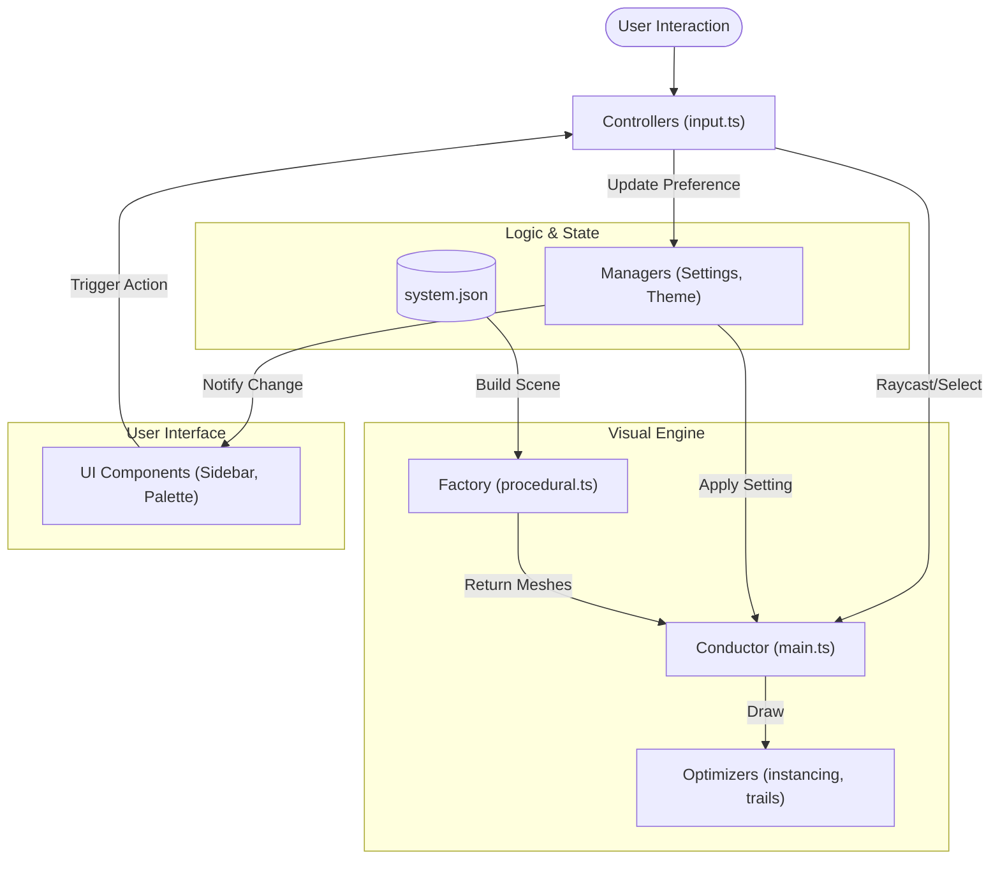

# Contributing to Solar-Sim

Welcome to the Solar-Sim project! 🚀

First off, thank you for considering contributing. It's people like you that make things happen. This guide will help you get started with the codebase and our development workflow.

## Table of Contents
1. [Getting Started](#getting-started)
2. [Project Structure](#project-structure)
3. [Coding Standards](#coding-standards)
4. [Documentation Standards](#documentation-standards)
5. [Testing Standards](#testing-standards)
6. [Pull Request Process](#pull-request-process)

---

## Getting Started

Since this project uses vanilla ES Modules and Three.js via CDN, you don't need `npm install` or a build step!

### Prerequisites
- **Python 3** (or any static file server like `http-server`)
- A modern web browser (Chrome, Firefox, Safari)

### Setup
1. **Fork and Clone** the repository.
2. **Download Textures** (Required for first run):
   ```bash
   python3 download_textures.py
   ```
   This script fetches high-res planet textures into the `textures/` directory.

3. **Run the Server**:
   You must serve the files over HTTP to support ES6 imports.
   ```bash
   python3 -m http.server
   ```

4. **Open in Browser**:
   Navigate to `http://localhost:8000`.

---

## Project Structure

We follow a modular architecture without bundlers.

- **`index.html`**: The entry point. Loads styles, Three.js (via Import Map), and `src/main.ts`.
- **`src/main.ts`**: The "Conductor". Initializes the scene, render loop, and coordinates modules.
- **`src/procedural.ts`**: The "Factory". Pure functions that generate 3D objects (planets, stars).
- **`src/input.ts`**: The "Controller". Handles user input, raycasting, and UI updates.
- **`src/components/`**: UI classes (e.g., `CommandPalette.ts`, `NavigationSidebar.ts`).
- **`src/managers/`**: State managers (e.g., `ThemeManager.ts`).
- **`system.json`**: The data source for the solar system hierarchy.

### Component Architecture

The Solar-Sim UI is built on a **Decoupled Architecture** to ensure that the 3D scene (Three.js) remains performant and independent of the DOM.

**Separation of Concerns:**
1.  **Scene (`main.ts`)**: The "Conductor". It knows nothing about the UI. It exposes methods to manipulate the camera or focus on objects.
2.  **Input (`input.ts`)**: The "Controller". It bridges the gap. It listens for user actions (clicks, keys) and updates the UI or the Scene accordingly.
3.  **Components (`src/components/`)**: Pure UI classes. They do not import Three.js directly (mostly). They receive data and callbacks via their constructors.

**Core Components:**

| Component | Responsibility | Communication |
| :--- | :--- | :--- |
| **NavigationSidebar** | Renders the recursive planet tree. | Calls `onSelect(name)` when a planet is clicked. |
| **InfoPanel** | Displays details of the selected object. | Updates via `update(mesh)` method. No internal state. |
| **CommandPalette** | "Cmd+K" power menu. | Executes callbacks for global actions (e.g., `onToggleOrbits`). |
| **Modal** | Accessible `<dialog>` wrapper. | Manages focus trapping and lifecycle (`open`/`close`). |
| **SettingsPanel** | Slide-out preferences menu. | Subscribes to `SettingsManager` and triggers callbacks. |

### Architecture Visualization

The following diagram illustrates the flow of data and events between the core modules:



### State Management

We avoid global state objects. Instead, we use dedicated **Managers** (`src/managers/`) that follow the Observer pattern.

| Manager | Responsibility | Persistence |
| :--- | :--- | :--- |
| **SettingsManager** | Source of truth for all simulation preferences (speed, textures, visibility). | `localStorage` (JSON string) |
| **ThemeManager** | Manages visual aesthetic (Default, Blueprint, OLED) via CSS variables. | `localStorage` (Theme ID) |

- **SettingsManager**: Components `subscribe()` to changes for reactive UI updates.
- **ThemeManager**: Orchestrates theme shifts by updating the `data-theme` attribute on the `<html>` element.

### Data Flow: From JSON to Scene

Understanding how `system.json` turns into a 3D orbit:

1.  **Loading**: `main.ts` fetches `system.json`.
2.  **Factory**: `procedural.ts` (`createSystem`) iterates through the data.
3.  **Physics**: For each body, the `physics` elements are stored in `mesh.userData.orbit`.
4.  **Integration**: In the `animate` loop (in `main.ts`), `physics.getOrbitalPosition(orbit, time)` calculates the AU position.
5.  **Scaling**: `physics.physicsToRender(auVector)` applies Multi-Zone Scaling to transform AU into Three.js units.
6.  **Rendering**: The mesh position is updated, and `trails.ts` adds a vertex to the trail.

---

## Coding Standards

### 1. TypeScript
- Use **TypeScript** for all logic. Prefer interfaces over inline types.
- Strict mode is enabled: avoid `any` whenever possible.
- Use ES Modules (`import`/`export`).
- Use `const` and `let` (avoid `var`).
- Prefer `async/await` over raw Promises.

### 2. Three.js Patterns
- **Memory Management**: Always dispose of Geometries and Materials if you remove them.
- **Performance ("Bolt")**:
    - Use `instancing.js` for repeated objects (moons, asteroids).
    - Use `trails.js` for orbit lines.
    - Throttle expensive operations in the render loop (use `frameCount`).

### 3. CSS & Design
- Use **CSS Variables** defined in `src/style.css`.
- Follow the "Glassmorphism" design tokens.
- Ensure all interactive elements have focus states and `aria-labels`.

---

## Documentation Standards ("Scribe")

We believe that **"If it isn't documented, it doesn't exist."**

### JSDoc / TSDoc
All functions and classes must be documented using JSDoc/TSDoc. Include parameter types and return values where applicable.

```typescript
/**
 * Calculates the distance between two objects.
 * @param objA - The first object.
 * @param objB - The second object.
 * @returns The Euclidean distance.
 */
function getDistance(objA: THREE.Object3D, objB: THREE.Object3D): number { ... }
```

### Key Principles
- **Why > What**: Explain *why* a complex logic block exists.
- **No Magic Numbers**: If you use a number like `0.004`, explain it (e.g., `// Approximation of orbital speed`).
- **Update the README**: If you add a feature, list it in `README.md`.

---

## Testing Standards

We use **Playwright** for End-to-End (E2E) testing. All new UI features must include corresponding tests in the `tests/e2e/` directory.

### 1. Structure
Tests are organized by component or user flow:
- `navigation-sidebar.spec.js`: Tests for the planet tree and search.
- `settings-panel.spec.js`: Tests for toggles, themes, and persistence.
- `keyboard-shortcuts.spec.js`: Verifies all global hotkeys.

### 2. Best Practices
- **Isolation**: Each `test()` block should ideally be independent.
- **Wait for Loading**: Always wait for the `#loading-screen` to be hidden before interacting with the simulation.
  ```javascript
  await page.waitForSelector('#loading-screen', { state: 'hidden', timeout: 60000 });
  ```
- **A11y Checks**: When possible, use ARIA roles for selectors (`page.getByRole('button', { name: 'Close' })`).

### 3. Running Tests
- `npm run test` (if configured) or `npx playwright test`.
- Use `--headed` to see the browser in action.
- Use the **Playwright Report** (`npx playwright show-report`) to analyze failures.

---

## Pull Request Process

1. **Branching**: Create a branch for your feature (`feature/new-planet`) or fix (`fix/orbit-bug`).
2. **Testing**:
   - Manually verify your changes in the browser.
   - Check the console for errors.
   - Ensure the "Welcome" modal and Command Palette still work.
3. **Submission**:
   - Open a PR against `main`.
   - Describe your changes clearly.
   - Include screenshots for visual changes.

Happy Coding! 🪐
